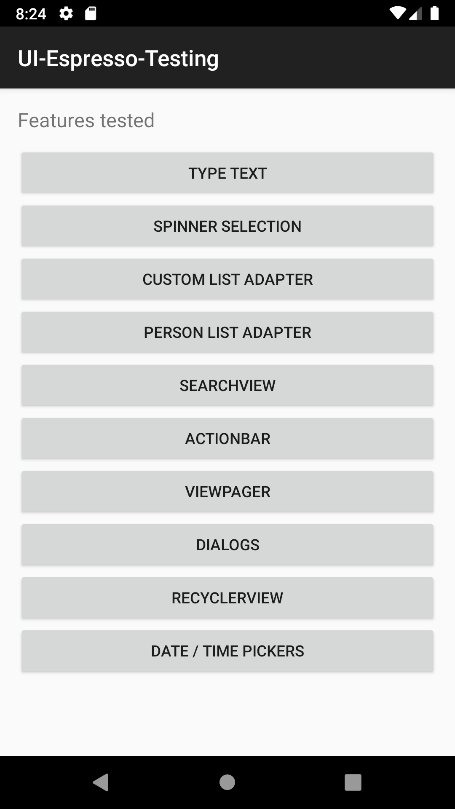

# UI Espresso Tester
A collection of examples demonstrating different techniques for automated testing with Espresso.
 
  - <em>You are free to use any resource, Google, etc.</em>
  - <em>Please write all code youself<em> 

  - *PLEASE STAY OUT OF BRANCH MAIN -Thanks.*
  - *NOT tested on Windows.*
  - *you should know a bit of Git to do this.*
  - *Preferred - write code in Kotlin - but you can use Java.*

# Start
You will be in the `main` branch when you start
Please switch to a testing branch

  - git clone the repository (AndroidStudio-AppTesting) into your preferred directory
  - checkout branches for tests
  - like `git checkout test-a`

## Challenges

  - start with test-a
  - finish with test-b
  - extra test-c

Search for *WORK* to find tasks
in the `CustomListTest`(test-a,test-b) or PersonListTest(test-c)

## finish

 - git commit all of your work
 - from a branch just
 - `git push -U origin <test-a>` if working on test a

# Thanks

